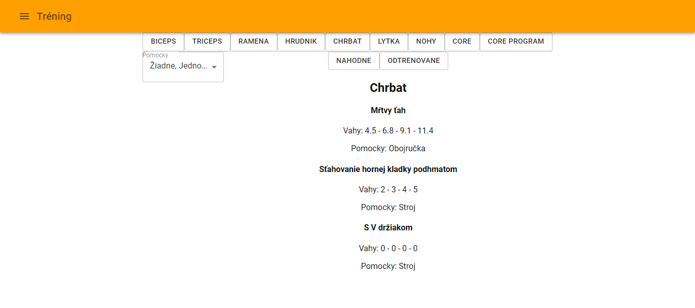
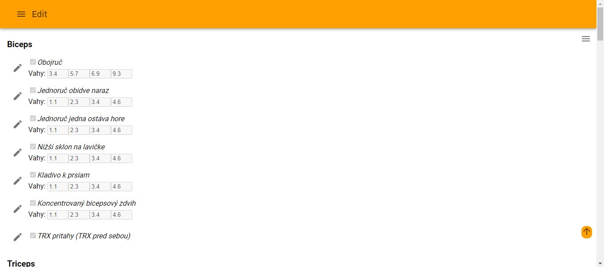
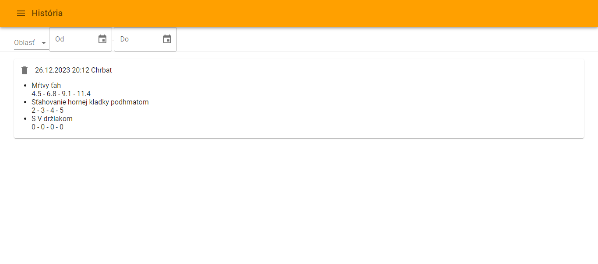

# MyGym App

Welcome to the MyGym App! This React-based mobile application helps you manage your workout routines, track your exercise history, and plan your fitness journey effectively.

## Features

1. Main Page

- View and manage your exercises on the main page.
- Track your workout history and achievements.
- Choose your workout location from the provided options.

2. Edit Exercises

- Customize your exercise list by adding or removing exercises.
- Tailor your workout routine to match your fitness goals.

3. Export Data

- Export your exercise data for further analysis or sharing.
- Share your workout progress with friends or fitness professionals.

4. Exercise History

- Explore a detailed history of your workout sessions.
- Analyze your performance and set new fitness goals.

5. Reset

- Reset your exercise history and start fresh.
- Clear previous workout data to begin a new fitness chapter.

## Installation

1. Clone the Repository:
```git clone https://github.com/yourusername/fitness-app.git```

2. Navigate to the Project Directory:
```cd fitness-app```

3. Install Dependencies:
```npm install```

4. Run the App:
```npm start```

5. Open in Browser:
Open your browser and go to http://localhost:3000 to view the app.

## Technologies Used

- React: A JavaScript library for building user interfaces.
- React Router: A standard library for routing in React applications.
- Material-UI: A React component library that implements Google's Material Design.

## Screenshots







## License

This Fitness App is released under the MIT license. See the [LICENSE](LICENSE) file for details.
